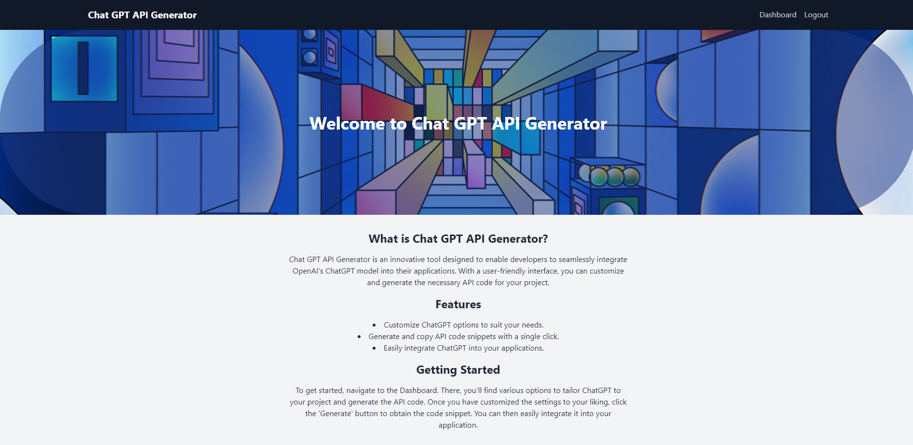

# ChatGPT API Template - MERN Stack



This MERN (MongoDB, Express.js, React.js, Node.js) stack template allows you to create a web application integrated with the ChatGPT API from OpenAI. With this template, you can quickly set up a powerful chatbot application with a backend server and a user-friendly front-end.

## Live Demo

[Live Demo](https://chat-gpt-api-generator-e42f3131abd6.herokuapp.com/)

## Overview

This project serves as a starting point for building applications that leverage OpenAI's ChatGPT API for generating human-like responses. It combines the capabilities of various technologies and tools to create a robust chatbot application.

### Technologies Used

- **MongoDB**: A NoSQL database for storing user data and search history.
- **Express.js**: A web application framework for building the server-side logic.
- **React.js**: A JavaScript library for building the user interface.
- **Node.js**: A JavaScript runtime for building the server.
- **JSON Web Tokens (JWT)**: Used for user authentication and authorization.
- **React Router**: For handling client-side routing.
- **Tailwind CSS**: A utility-first CSS framework for responsive and clean styling.
- **Vite**: A build tool that serves as a development server for the client-side application.
- **OpenAI's GPT-3.5 model/engine**: For generating responses based on user input.

## Getting Started

Follow these steps to set up and customize your chatbot application:

### Installation

1. Clone this repository to your local machine.
2. Navigate to the directory containing the cloned repository using the terminal.
3. Run `npm install` to install the necessary dependencies.

### Configuration

To use this application, you need to set up the environment variables:

1. Create a file named `.env` in the server directory of the cloned repository.

2. Open the `.env` file in a text editor and add the following environment variables and their corresponding values:

   ```plaintext
   # MongoDB URI
   MONGODB_URI=your_mongodb_uri

   # JSON Web Token (JWT) Secret
   JWT_SECRET=your_jwt_secret

   # OpenAI API Key
   API_KEY=your_openai_api_key
   ```

   - `MONGODB_URI`: Replace `your_mongodb_uri` with the URI of your MongoDB database. Ensure you have a MongoDB database set up.
   - `JWT_SECRET`: Replace `your_jwt_secret` with a strong secret key for JWT authentication.
   - `API_KEY`: Replace `your_openai_api_key` with your API key obtained from the OpenAI website.

   Remove the `your_` prefix and use your actual values.

3. Save the `.env` file.

Similarly, please note the following environment variable related to the client (Vite):

- In the `client` directory, you should have a `.env` file with the following content:

   ```plaintext
   VITE_REACT_APP_BASE_URL=http://localhost:2121
   ```

This environment variable sets the base URL for your client application when using Vite. It's important for routing and making API requests from the client.

After installing dependencies and configuring the environment variable, you should be ready to run and develop your MERN stack application with the specified settings.

### Usage

1. In the terminal, navigate to the root directory of the project and start the application:

   ```bash
   npm run dev
   ```

2. Access the application in your web browser at `http://localhost:5173/`. Or whichever port displays or works best for your VITE dev mode.

3. Create a login account / register your demo application:

Most notably, register an account that correlates to `line 93` of `client\src\components\Login.jsx`.

These lines could be removed or modified for your purposes.

```
  const handleDemoLogin = () => {
    setEmail("demo@example.com");
    setPassword("password");

    // Start the login process
    setIsLoggingIn(true);
  };
```

4. Login to your newly created account or demo account.

5. Navigate to the dashboard page and enter your input text into the chat interface and press Enter or click the Generate button.

6. The application will generate responses using the ChatGPT API, and the conversation will be displayed in real-time.

## Notes

- This template is designed for demonstration purposes and serves as a foundation for building chatbot applications.
- Be aware that the ChatGPT API is a paid service, and you should review the pricing and billing information on the OpenAI website.
- The GPT-3.5 model/engine from OpenAI powers the chatbot, providing human-like text generation capabilities.

## Contributing

If you would like to contribute to this project:

1. Fork the repository.

2. Create a branch for your changes.

3. Make your changes and commit them with clear and concise messages.

4. Push your changes to your forked repository.

5. Submit a pull request with a detailed explanation of the changes and their significance.

## License

This project is licensed under the MIT license.

**Make sure to set up the environment variables as instructed before running the application.**

Enjoy building your ChatGPT-powered chatbot application using the MERN stack!